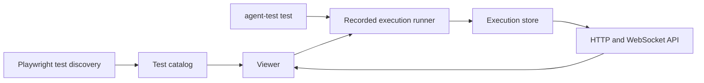

# CLI

<!-- source-of-truth: TypeScript suite commands and discovery -->
<!-- doc-meta: owner=eng | last-reviewed=2026-09-17 -->
<!-- review-deps: paths=packages/test/src/cli.ts,packages/test/src/sdk/cli.ts,packages/test/src/sdk/viewer.ts,packages/test/package.json -->

The CLI runs the TypeScript SDK through Playwright Test. It does not load `.env`.

| Command | Behavior |
| --- | --- |
| `agent-test test --list` | Discover tests without starting agents |
| `agent-test test tour` | Execute the worked examples with the default agent |
| `agent-test test --config path/to/config.ts` | Use another configuration |
| `agent-test test --reporter=html` | Write a Playwright HTML report |
| `agent-test viewer --config agent-test.config.ts --port 0` | Open the localhost viewer; zero selects a free port |
| `agent-test login` | Authenticate the Cursor SDK |
| `agent-test login --host openai` | Run Codex login |

Claude users authenticate through the Claude Code CLI. Model and billing are configured on agent definitions, not legacy scenario flags.

The viewer discovers the same TypeScript tests as the CLI, records every execution under `.agent-test/executions`, and restores the newest 50 completed runs after a restart. While a viewer is open, a new running execution started from either the viewer or `agent-test test` is selected automatically and streams through the same live execution page. It supports cancellation for viewer-started runs, live updates, and reload-safe execution details. Run artifacts remain under the test output directory. It binds to localhost only.

The browser only receives the catalog and execution records. Transcript, test output, diagnostics, and named agent or judge operations are read from the selected execution record. The WebSocket handshake is defined in AsyncAPI and uses a token scoped to the local viewer process; the HTTP methods used by the browser are generated from the OpenAPI document.

JSON suites, `--suites-dir`, `--check`, `--fail-on`, automatic judges, and the detached HTML report preview have been removed. Unknown commands fail with migration guidance. Configure deadlines, projects, workers, retries, and reporters through Playwright options and `defineConfig`.

See [the SDK guide](sdk-v2.md) for sample workspaces, answer checks, and judge inputs.
