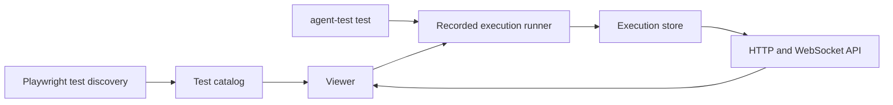

# CLI

<!-- source-of-truth: TypeScript suite commands and discovery -->
<!-- doc-meta: owner=eng | last-reviewed=2026-10-09 -->
<!-- review-deps: paths=packages/test/src/cli.ts,packages/test/src/sdk/cli.ts,packages/test/src/sdk/viewer.ts,packages/test/src/sdk/execution-runner.ts,packages/test/src/sdk/execution-store.ts,packages/test/package.json -->

The CLI runs the TypeScript SDK through Playwright Test. It does not load `.env`.

| Command | Behavior |
| --- | --- |
| `agent-test test --list` | Discover tests without starting agents |
| `agent-test test tour` | Execute the worked examples with the default agent |
| `agent-test test --config path/to/config.ts` | Use another configuration |
| `agent-test test --reporter=html` | Write a Playwright HTML report |
| `agent-test viewer --config agent-test.config.ts --port 0` | Open the localhost viewer; zero selects a free port |
| `agent-test login` | Authenticate the Cursor SDK |
| `agent-test login --host openai` | Run Codex login |

After a recorded run, `agent-test test` prints the viewer command for the same configuration, for example `View run 1a2b3c4d: agent-test viewer`. It prints nothing after `--list` or when `CI=true`. When standard output is not a terminal, which usually means a coding agent started the run, it adds one line telling the agent to ask the user before starting the viewer. The viewer is a long-running localhost server, so an agent must not start it without a yes.

Claude users authenticate through the Claude Code CLI. Model and billing are configured on agent definitions, not legacy scenario flags.

The viewer discovers the same TypeScript tests as the CLI, records every execution under `.agent-test/executions`, and restores the newest 50 completed runs after a restart. Before either the CLI or viewer starts another recorded run, it marks any dead-owner execution as interrupted; recovery does not require opening viewer history. The home page is a run inbox: the running or newest run, with failed tests first and each test's own result, then earlier runs. While a viewer is open, a new running execution started from either the viewer or `agent-test test` is selected automatically and streams live: a single-test run opens on that test's page, and a batch opens its run overview. It supports cancellation for viewer-started runs, live updates, and reload-safe execution details. Durable run artifacts remain under the test output directory; full-tree snapshots are removed at test teardown or terminal execution recovery. See [storage retention](isolation.md#storage-ownership-and-retention) for byte budgets and the bounded source evidence contract. It binds to localhost only.

```mermaid
flowchart LR
  Discovery["Playwright test discovery"] --> Catalog["Test catalog"]
  Catalog --> Viewer["Viewer"]
  CLI["agent-test test"] --> Runner["Recorded execution runner"]
  Viewer --> Runner
  Runner --> Store["Execution store"]
  Store --> API["HTTP and WebSocket API"]
  API --> Viewer
```

The browser only receives the catalog and execution records. Transcript, test output, diagnostics, and named agent or judge operations are read from the selected execution record. The WebSocket handshake is defined in AsyncAPI and uses a token scoped to the local viewer process; the HTTP methods used by the browser are generated from the OpenAPI document.

JSON suites, `--suites-dir`, `--check`, `--fail-on`, automatic judges, and the detached HTML report preview have been removed. Unknown commands fail with migration guidance. Configure deadlines, projects, workers, retries, and reporters through Playwright options and `defineConfig`.

See [the SDK guide](sdk-v2.md) for sample workspaces, answer checks, and judge inputs.
