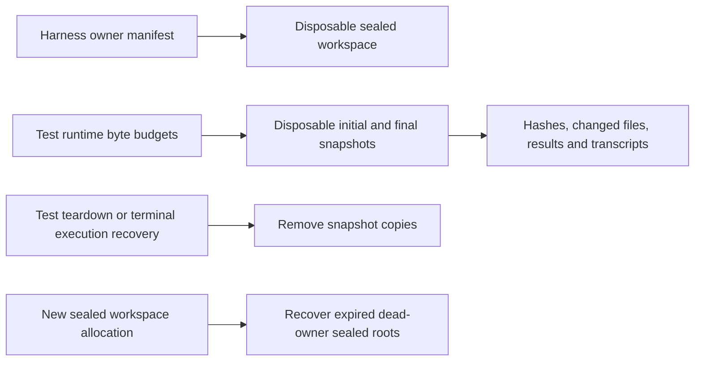

# Isolation

<!-- source-of-truth: fixture workspace ownership and judge evidence -->
<!-- doc-meta: owner=eng | last-reviewed=2026-10-09 -->
<!-- review-deps: paths=packages/harness/src/sealed-workspace.ts,packages/harness/src/host-isolation.ts,packages/harness/src/shell-paths.ts,packages/harness/src/user-skills.ts,packages/test/src/sdk/workspace.ts,packages/test/src/sdk/runtime.ts,packages/test/src/sdk/judge.ts,packages/test/src/sdk/snapshot-storage.ts,packages/test/src/sdk/execution-store.ts,packages/harness/src/sealed-storage.ts,packages/harness/src/process-owner.ts -->

Every `agent.run` owns a sealed temporary Git workspace and host session. Independent runs may execute concurrently. Only `run.continue` shares the original task workspace and history.

A test owns all its runs and evaluations. Teardown aborts pending operations, waits for them to settle, and closes sessions and workspaces. Built-in host deadlines cancel stalled operations while retaining streamed trace evidence; agent-test records the timeout as an infrastructure failure. POSIX workers terminate their process groups. Setup callbacks run before the host starts and remain test-owned code.

Workspace source paths resolve against the config directory. A fixture folder is copied; the default dot uses committed HEAD. Attached skills and context are supplied afterward. Global skills remain excluded unless explicitly enabled.

## Isolation boundary

Two layers keep an agent inside its workspace. The host enforces filesystem limits, and agent-test rejects any run whose tool calls name a path outside the workspace.

| Host | Enforced by the host | Outside the boundary |
| --- | --- | --- |
| OpenAI (Codex) | A permission profile replaces `--sandbox`. The workspace is writable (read-only for judges). The OS temp folder, which holds sibling sealed workspaces, `/tmp`, and the caller checkout are denied for reads and writes. Network is off unless `networkAccess` is set. | Other paths on disk remain readable. Detection still applies. |
| Claude Code | `--settings` enables the Bash sandbox with reads of the checkout and the temp folder denied (the workspace is re-allowed) and no unsandboxed fallback. Permission rules block Read, Grep, and Glob outside the workspace. | Other paths remain readable by Bash. Detection still applies. |
| Cursor | Nothing. | Detection only. |
| Custom adapters | Whatever the adapter declares. | Detection only. |

The caller checkout is the Git top level of the config directory, or the config directory itself outside Git. It holds the suites and their expected answers.

Detection runs after every agent and judge turn and fails the operation with `WorkspaceEscapeError`, which carries the escaped `paths` and the `trace`. It checks direct path arguments (`path`, `file_path`, `uri`, `cwd`, an absolute Glob `pattern`) and shell commands. A shell command is unwrapped from `sh -c`/`zsh -lc`, split into simple commands, and tokenized. Absolute paths whose top-level directory exists, `~`, `$HOME`, and any token with a `..` segment count as paths. Relative paths resolve against the tool `cwd` and follow `cd`. Read-only system roots (`/bin`, `/usr`, `/sbin`, `/System`, `/Library`, `/opt`, `/dev`) are allowed. Detection is evidence of an attempt; host enforcement is what keeps the content out of the transcript.

The sealed manifest (`owner.json`) sits next to the workspace and records no caller path. Snapshot copying rejects symlinks and excludes `.git`, `node_modules`, `.agent-test`, `.qualification-cache`, `.venv`, and `__pycache__` at every depth. These checks do not sandbox setup callbacks or adapter code, which run as test-owned code.

Judges run in an empty sealed workspace in the OS temp folder with its own Git root, so no caller AGENTS.md or CLAUDE.md is discovered and no run artifacts are nearby. Codex judges also load no project instructions. The same host limits and detection apply. The caller selects JSON input. Requests, responses, schema validation errors, and separate token usage are recorded under the test output folder, not in the judge workspace. See [the SDK guide](sdk-v2.md#explicit-judge-inputs).

`agent-suites/test-sdk-capabilities` includes a live probe: a canary written into the checkout must not appear in any tool result, and the run must fail with `WorkspaceEscapeError`. The SDK contract suite mirrors the rejection offline.

## Storage ownership and retention

Snapshots remain readable through test assertions, judges, and continuations. Test teardown removes full-tree copies on success, failure, and cancellation. Recorded execution finalization and startup recovery retry this cleanup after interruption. `run.workspace.initial.path` and `final.path` therefore describe temporary copies; their `files` hash/size maps remain in `run.json` and snapshot sidecars after teardown. Callers that need file contents after teardown must explicitly export them during the test or use the bounded `changed-files/` evidence.

Each operation preserves changed-file contents in `changed-files/` and additions, modifications, deletions, and budget omissions in `changes.json`. A failure attempts a final snapshot before teardown; if capture cannot complete, `source-evidence-error.json` records why. A hard kill can prevent final source capture. Previously completed artifacts and atomic snapshot sidecars remain recoverable. Transcripts, execution summaries, progress, errors, judge output, and arbitrary attachments survive snapshot cleanup. The existing policy keeps the newest fifty completed executions; active executions are outside that count. Unknown legacy snapshot folders without sidecars are preserved until their execution ages out of that history limit.

| Environment variable | Default | Contract |
| --- | --- | --- |
| `AGENT_TEST_SNAPSHOT_MAX_BYTES` | 1 GiB (`1073741824`) | Shared byte allowance for all initial/final copies in one test runtime, including continuations and failure capture. A streaming meter stops a growing file before exceeding the allowance. |
| `AGENT_TEST_SOURCE_EVIDENCE_MAX_BYTES` | 16 MiB (`16777216`) | Separate shared allowance per test runtime for changed-file contents. Oversized changes are explicitly marked `omitted-budget`; they are not silently truncated. |
| `AGENT_TEST_MIN_FREE_BYTES` | 1 GiB (`1073741824`) | Free-space floor checked before each copied file, including its current size. Concurrent external disk writes can still consume free space. |
| `AGENT_TEST_SNAPSHOT_EXCLUDE_NAMES` | empty | Additional comma-separated directory/file basenames excluded at every depth. For example, `target,dist,.next` avoids generated builds when those names contain no required evidence. |

Limits are nonnegative safe integer bytes; invalid settings fail before agent execution. Zero is an explicit zero allowance (or disables the free-space floor). Default exclusions apply only to evidence snapshots. Sealed fixture materialization remains faithful to its source, including dependencies/builds needed by the test. `dist` and `target` are not automatically omitted because suites can use them as meaningful inputs or outputs. Parallel tests have independent budgets; these limits do not constitute a machine-wide quota on arbitrary agent output, preparation caches, native builds, or durable transcripts. Qualification launchers must enforce their own aggregate budget and provide suitable exclusion names and worker counts.

Harness temporary roots have layout `agent-harness-seal-*/owner.json` plus `workspace/`. The manifest records version, owner PID and process start identity where available, and creation time. It does not record the caller checkout, because the agent can read it. It sits outside the agent's working tree. Setup failures and ordinary teardown remove the whole owned root. New allocations sweep roots at least 24 hours old only after their owner exits or its start identity changes. Unavailable process identity and permission errors protect a live PID conservatively. Unknown, corrupt, unversioned, and symlink roots are preserved. Legacy roots require explicit inspection, not generic deletion.

The harness exports `recoverSealedWorkspaces({ temporaryRoot?, minimumAgeMs? })` for an orchestrator to run the same recovery explicitly; the default temporary root is the OS temp directory and the default age is 24 hours. A controlled forced-termination trial can use `minimumAgeMs: 0` after confirming the worker has exited. This API deletes only versioned harness roots. Descendant processes surviving their owning worker are not independently leased; the default grace period allows them to exit. Consumers with detached long-lived descendants must keep the owner alive or manage that separate lifetime themselves.

Agent-test owns `.agent-test/executions`, test output snapshots, and their evidence sidecars. The harness owns only its versioned sealed temporary roots. Skeleton owns `.qualification-cache`, preparation workspaces, and native build namespaces; neither recovery implementation removes those roots. A Skeleton launcher can set the environment above on its recorded agent-test child and call harness recovery through the public API. Export any additional qualification evidence before test teardown, and upgrade both packages together when adopting this contract.
