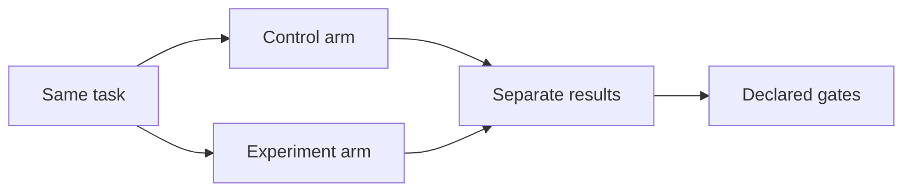

# Layered agent-test showcase

<!-- source-of-truth: decisions for the layered showcase -->

<!-- doc-meta: owner=eng | last-reviewed=2026-09-15 -->

<!-- review-deps: paths=agent-suites/**/scenarios.json,package.json,packages/test/src/types.ts,packages/test/src/compare-scenario.ts,scripts/test-sdk-*.mjs,scripts/test-reliability.mjs -->

Status: implemented.

## Goal

Replace the old examples with tests that teach the product, define the public contract, and provide a stable pull request gate.

## Decisions

- `tour` is a seven-scenario product tour.
- `reference` is the complete runnable reference.
- `confidence` is the six-scenario Cursor pull request gate.
- Each scenario starts in a new sealed workspace.
- Most scenarios use one small TypeScript task-list project.
- Skill tests use a separate copy so the skill cannot affect other tests.
- Test names, prompts, descriptions, questions, and failures use Simple English.
- Host matrices and the 20-run qualification are manual.
- CI runs offline checks and uses Cursor only when its key exists.

## Comparison contract

A comparison keeps a separate outcome and measurements for each arm. Gates can check outcome, turns, tokens, tools, duration, or one per-arm judge question. Numeric pair gates require the named winner to use less. Outcome and judge pair gates require the winner to pass and the loser to fail. Every declared gate must pass. A tie or missing value fails a strict gate. Metrics with no gate remain information. Reports do not invent one overall winner.

The old `compare.faster` and `compare.cheaper` fields are removed. Configuration checks reject them and show the gate migration.

## Test layers

The product tour covers project facts, diagnosis, repair, MCP, skills, three MCP workflows, and a control-versus-tool experiment.

The reference covers suite defaults, overrides, context, workspaces, skills, MCP, seed patches, every deterministic matcher, ordered tools, sidecar rubrics, skip, routing, review depth, two-arm gates, named arms, judge metrics, and informational metrics.

The confidence gate covers exact text, one file read, one repair, ordered MCP calls, one skill judge, and the sealed boundary.

SDK coverage packs both packages, installs them in a clean Node 22 project, compiles public imports, runs a fake adapter, inspects comparison results, and runs the installed CLI. A separate manual smoke calls the direct API on Cursor, Claude, and Codex.

The reliability command runs deterministic good and bad controls, then runs Cursor confidence 20 times. Each scenario needs at least 19 clean behavior runs and 19 clean infrastructure runs. The judge needs at least 19 passes. Any workspace leak, recording error, or judge-format error fails the qualification.

## Verification

- All suite files must pass `agent-test --check`.
- Unit tests must cover every gate form in pass and fail cases.
- Console, viewer, HTML, and debug output must show arm outcomes and gates.
- The installed package test must need no host credentials.
- The Cursor confidence gate is the required live pull request proof.
- The host matrix and 20-run qualification remain manual proofs.
